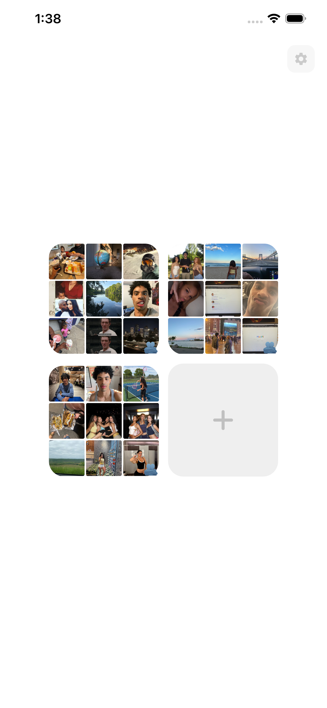
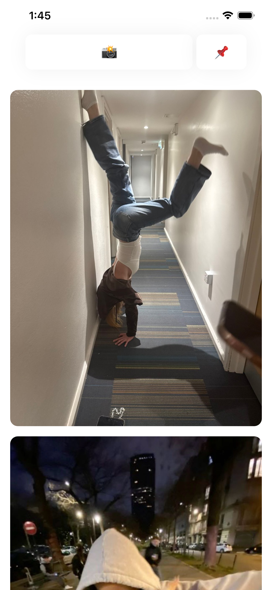
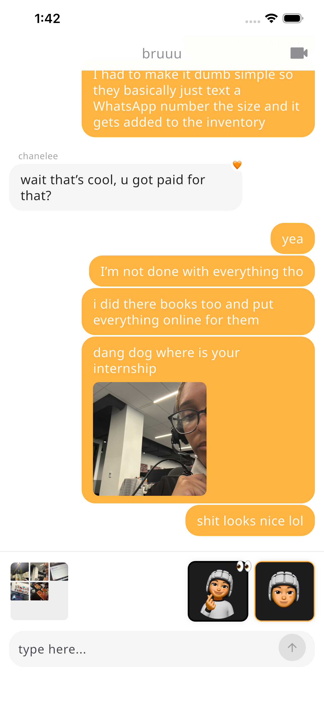

# whomatters

**Everyone builds apps to get big. I'm building one to stay small — on purpose.**

whomatters is like going to lunch with your best friend. Just your table, just your talk. Nobody else invited. Nobody else watching.

📱 **Live on the App Store:** https://apps.apple.com/us/app/whomatters/id6758853646

  
  
  
  

## The simple thing nobody says

You can't feel close to a million people. You can't even feel close to a hundred.

The feed made everyone easy to reach and everyone more alone. You have thousands of followers and none of them really see you. That's not a glitch. That's just what happens when you take something small and warm and try to make it huge.

Make a relationship big enough and it stops being a relationship.

## Why the "connection" apps don't connect

To get big, an app has to put everyone in one room. One feed. One crowd. One stage.

And the moment a room has a crowd in it, you start performing. You're not talking to your friend anymore — you're talking to everyone. So you post the good photo, the good angle, the best version of your day.

The app *wants* this. It grows when you reach more people, so it pays you to treat your life like a show and your friends like an audience. The bigger it gets, the more it turns closeness into a performance.

You can't build a room big enough to feel cozy in.

## New paint, same house

Everyone knows the feed is broken now. So a hundred apps showed up saying they'd fix it. BeReal: one real photo a day. VSCO: no likes to count. All of them said "authentic," "real," "close friends only."

New paint. Same house.

They kept the one thing that's actually broken — a crowd watching — and just changed the color. BeReal still points you at a crowd; it just tells you to look ugly for them once a day. That's still a show. It's a show *about* being real, which is kind of worse.

You can repaint that house a thousand times. It's still the house that makes you lonely.

## The idea: don't grow the room. Make more rooms.

So whomatters doesn't grow the room. It makes tiny ones and makes a lot of them.

- **A "world" is 2 or 3 people.** That's the limit. It never changes.
- **No feed. No followers. No likes. No numbers. No strangers. No crowd.**
- Just you and the person who matters. You share the boring photos from your day, and you have a chat. That's it.

Here's the whole trick. Everyone tried to grow closeness by making one space **bigger**. But closeness only works when it's small. So the only honest way to grow it is to keep each space small forever and just **make more of them.** One world, then another, then a million — and every single one is still 2 or 3 people who love each other.

Instagram with 10 people and Instagram with a billion are two different animals. Size changed it. whomatters with 10 people and whomatters with 100 million is the exact same thing, because the small part never grows. A hundred million tiny worlds that never touch — instead of one giant one everybody drowns in.

## One rule for everything in the app

> Does this help your person, or does it help the app's numbers?

If it's a hook to pull you back, it's out. No pushy notifications. No streaks to make you feel bad. The only reason to open it is that someone you love is in there.

## Where it's at

Even as a plain web app — no notifications, no reminders, a little friction on purpose — **10 early users kept coming back for 90+ days.** No tricks. They just wanted it.

A small group uses it right now, and they don't "kind of like it." They love it. That's the only thing I care about, because you can't fake it and you can't buy it. I'd rather have ten people who'd be sad if it disappeared than ten thousand who forget it exists. The ten who love it tell their person. That's how it grows — one pair telling another, because it meant something.

---

*whomatters — the app that doesn't want to be a network. Proof that the answer to a lonely internet was never more connection. It was less, but real.*
